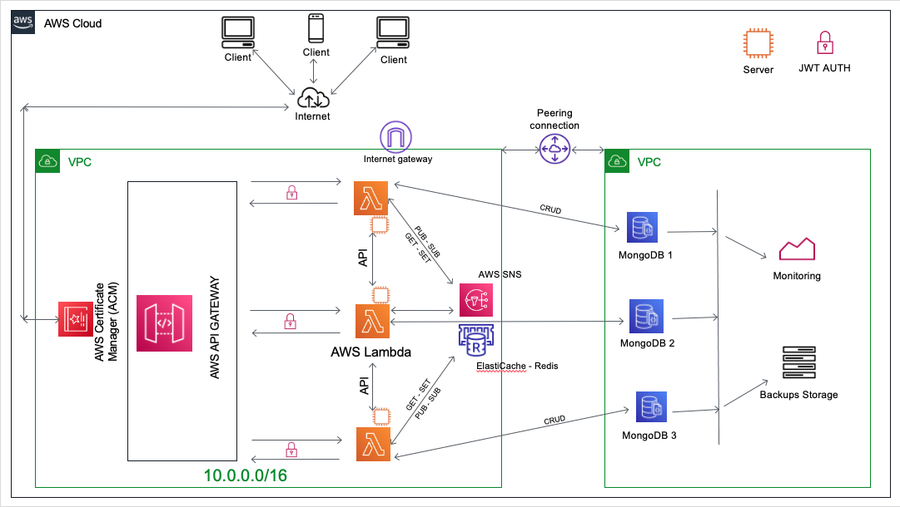
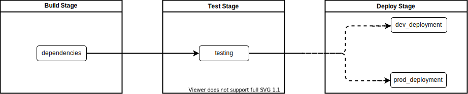

# NumericaIdeas - Microservice (NodeJS) 

## Architecture Diagram

This project serves as a simple micro-service usable to build highly scalable backends in an hybrid setup as part of a cloud migration, either in the cloud (Lambda or EC2) or into a custom VPS.

Let's note that for EC2 (VPS) deployment, Redis is mainly in used for inter-components communication, while AWS-SNS is used for the Lambda path.

More explanations about these architecture decisions are present in a blog post: https://blog.numericaideas.com/multipurpose-cloud-migration-nodejs

## Prerequisites
- **MongoDB** the NoSQL database management system.
- **NodeJS** installed and running, version >=10 (14 is recommended).
- **Redis** installed and running, it's used for the caching layer and some inter-services communication.
- **AWS CLI** for lambda deployments using NPM Scripts.

Note: *AWS CLI* isn't required since the CI/CD pipeline will always auto-deploy the App on changes made on develop (dev) and master (prod) branches.

## Running

First, you should install the dependencies by typing `npm install` command from the root folder of the project.

Then you can run it by executing either `node server.js`, `npm start`, `forever start server.js` or simply `nodemon server` (considering you have it installed) which enables live reloading at the same time.

Once it's running (non production profile), you can access the Swagger generated API docs at http://localhost:3000/api-docs.

## Tests

Unit tests are written using [AVAJS](https://github.com/avajs/ava), they are located into the **tests** folder and runnable with one of the following commands:
- npm test
- npx ava
- npm ava --watch (watch for changes then running the tests again)

Guide: [Syntax](https://github.com/avajs/ava/blob/master/docs/01-writing-tests.md) | [Assertions](https://github.com/avajs/ava/blob/master/docs/03-assertions.md) | [Timeouts](https://github.com/avajs/ava/blob/master/docs/07-test-timeouts.md)

## Environment variables
### (EC2 - VPS)
Use the .env (a copy of .env.sample file) to store sensitive config informations. The vars in use should be define in the config/index.js file explicitly for clarity/security purposes.

Be sure the lambda role has the "AWSLambdaFullAccess" permission.

### Lambda

- **dev.json** is in use for development.
- **prod.json** is in use for production.

Both files are created from **env.json** and are fetched/uploaded using the scripts **set-vars:env & get-vars:env**. These env variable are stored into secure buckets (ni-variables-dev & ni-variables-prod) S3 side.

## Deployments
### (EC2 - VPS)
Server deployment is comong and sometimes highly needed, here are some considerations to note:

- The environment variables should be provided into the .env file before hitting the command `forever server.js` to run the App.
- For server deployment the package node-cron is used to run cron job, but be aware we should make sure it's working well (no duplicates) for auto-scaling configurations.

### Lambda (Cloud Function)
If deployed with Lambda we first need to make sure that the env var for each environment is set explicitly into their respective files (dev.json and prod.json).

Then let's replace `AWS_ACCOUNT_ID` (package.json & in the policies folder) with our AWS account ID prior to follow the steps below:

1) Create the lambda: `npm run create-lambda`
2) Create the dev and prod SNS Topics and mention them in:
    - The file `policies/ni-sns-pubsub.json`.
    - In the NPM Script: sns:xxx
    - In the dev.json or prod.json files for lambda deployment.
3) Define the env vars for the lambda function (dev.json & prod.json)
4) Save those env vars on S3 using the command `npm run set-vars:dev` or `npm run set-vars:prod`.
5) Deploying/updating the App (claudia update):
    - `npm run deploy:dev` - Deploying the dev version
    - `npm run deploy:prod` - Deploying the prod version
6) Subscribing to the [SNS](https://github.com/claudiajs/claudia/blob/master/docs/add-sns-event-source.md) topic for pub/sub:
    - `npm run sns:dev` - Dev topic
    - `npm run sns:prod` - Prod topic
7) Run appropriate job-scheduler scripts to enable cron for Lambda: `npm run job:xxxxxx:xxx`
We need to deploy as many warmer as needed so that we have many lambda concurrent executions, meaning calling this script X times `npm run job:warm:xxx` per env.
8) Destroying: claudia destroy

## SNS (Lambda)
AWS-SNS here is in use for inter-services communication for Lambda deployments, you can customise its scripts parameters into the package.json file.

## AWS Scheduled Event (Lambda)
These events or notifications are used for two purposes:
- Warming the function (micro-service) to reduce the cold star period, that latency prior to our microservice to be fully usable.
- It's also in use to perform some cron jobs in the cloud, it'll send some action to the microservice at the specified parameterized times.

To warm the function 5 times and be sure there are at least 4/5 instances available to serve our requests we should run this `npm run job:warm:${env}` 5 times with different values into the events/warm.jon file:
- warm.json with the name field set to *LAMBDA_WARMER_1*.
- warm.json with the name field set to *LAMBDA_WARMER_2*.
- ...
- etc *LAMBDA_WARMER_n*, (as many warmers as you want).

**Note**: Let's remember to replace ${env} with the appropriate environment (dev or prod), it's just a placeholder.

**Note:**
- For lambda deployments be sure to always submit the var **IS_LAMBDA** with 'true' as value, it specifies that the microservice is run as a Lambda function.
- Don't mind the MongoParseError (Invalid connection string) warning while creating the function the first time, it happens because of the falsies values in the env.json file. Later dev/prod deployments will work.

## Clean codes recommendation
- Move all the controllers to the **controllers** folder.
- Create routes for API endpoints into the **routes** folder.
- Services can reside in the **services** folder.

## CI/CD Pipeline

### Lambda
For lambda deployments, we used **GitLab CI/CD tool(via .gitlab-ci.yml config file)** to automate the function deployment on AWS-Lambda using ClaudiaJS. You have to provide the right AWS user credentials that will be used to perform such tasks on your behalf.

The **Pipeline Architecture** looks like the following:

Under the hood ClaudiaJS uses **AWS-CLI** to interact with AWS resources, a walkthrough guide is available in the following article:
https://blog.numericaideas.com/easiest-gitlab-cicd-lambda-pipeline

## Testing

Once ran, we should have the text "SERVICE IS FINE" when attempting to access the [PING](http://localhost:3000/ni-microservice-node/pingify) endpoint.

By dassiorleando (NumericaIdeas.com).
